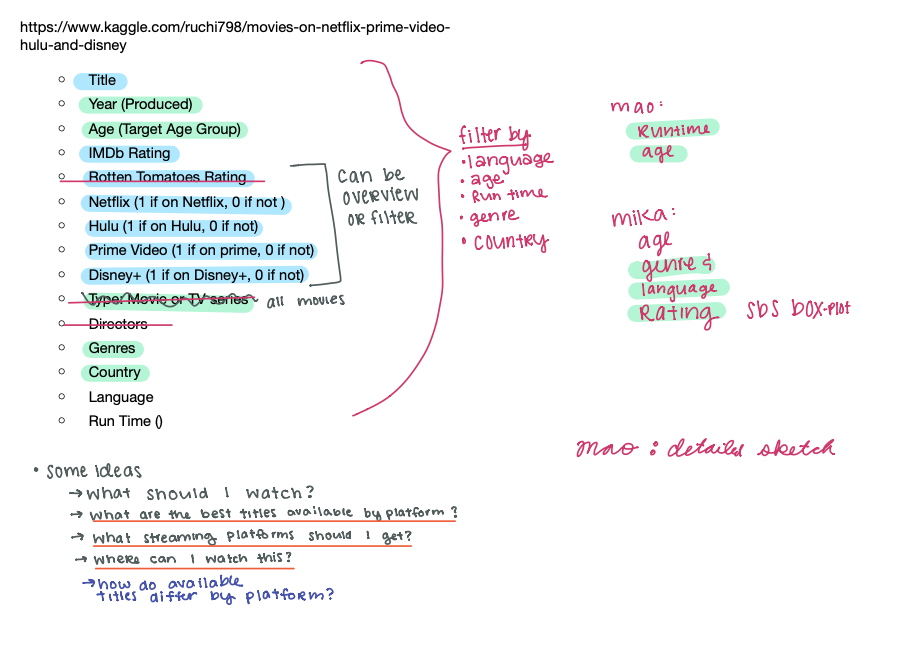
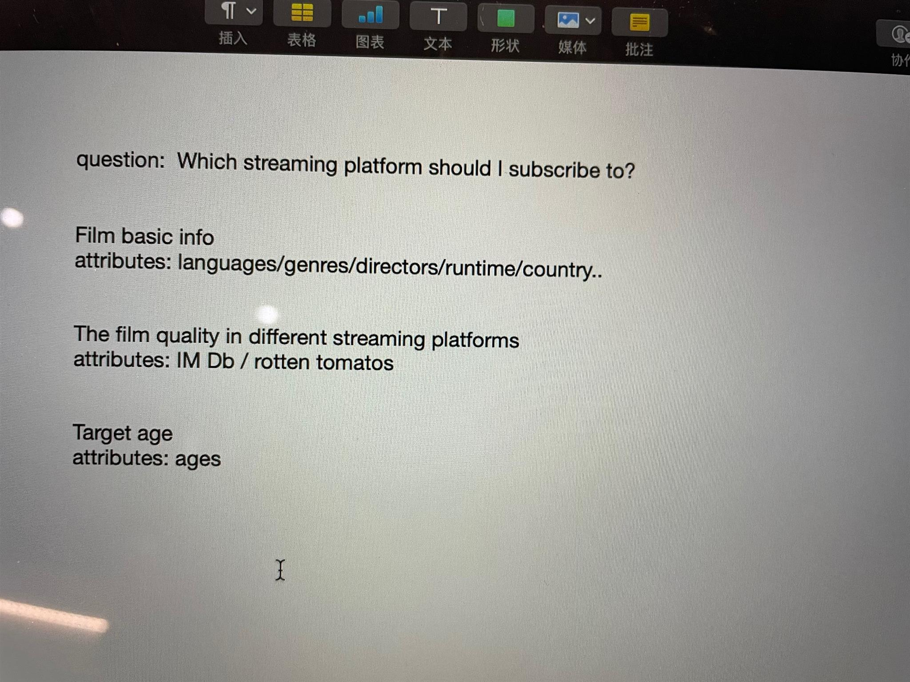

## Choosing a Question for the Chosen Data Set

**Chosen Data Set:** Finalised on Data Set: [Movies on Netflix, Prime, Hulu and Disney+](https://www.kaggle.com/ruchi798/movies-on-netflix-prime-video-hulu-and-disney)

These picture shows the process as we discussed which attributes we wanted to include in the final data set and some questions that may be good for this visualisation. 

