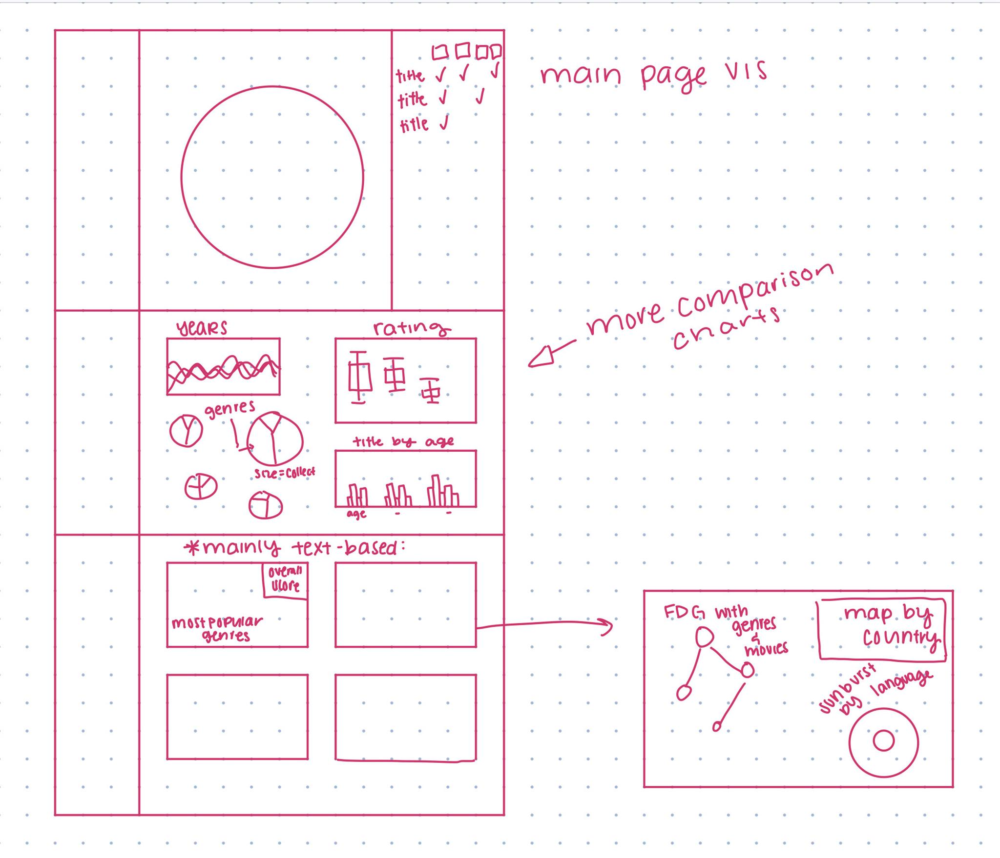

# Meeting Notes 

---
### Meeting 1: March 25, 2021

<ins>Goal:</ins> To discuss a plan and see what the other is interested in so we can begin to narrow down to datasets that we both like 
- We learned we both like netflix data  sets but are going to look for pop culture sets 

<ins>Next To Do:</ins>
 1. Find a data set we both interesting 
    how: put the data set link you interested on the teams (prefer no more than 3) and attached with a simple accommend reason until next meeting
 2. Brainstorming and pick a final data set 
    how: brainstroming
 3. Try to come up with a specific question
 4. Mika will set up a repository on Github to share code and a Trello Board to arrange next tasks once we have more information

---

### Meeting  2: March 31, 2021 (Over Message)
Goal: Combine data sets we were interested in (See [Here for Database Analysis](Choosing_A_Dataset.md))
- Finalised on Data Set: [Movies on Netflix, Prime, Hulu and Disney+](https://www.kaggle.com/ruchi798/movies-on-netflix-prime-video-hulu-and-disney)

<ins>Next To Do:</ins> 
  - Come up with questions our data visualisation can answer:
    - *Initial ideas:* what streaming services host the most tv shows / movies, who has the most highly rated movies / tv shows, etc.
  - Draw some sketches and meet again to compare them 

---

### Meeting  3: April 2nd, 2021 (Over Message)
Goal: Share Questions and finalise on one with sub questions 
- What platform should I subscribe to? 
  - Sub questions include: Which platform has the most in [chosen] language? Which platform has the most movies for [chosen] age group?
  - These will be expanded on as we draw our sketches

<ins>Next To Do:</ins>
- Begin Initial Sketches and share them when we meet again
- Mika to set up initial visualisation to begin writing the javascript and writing interactivity / filter functions. 

---

### Meeting  4: April 5, 2021
Goal: Share preliminary sketches and Ideas
- Explain the structure of the repository so we can ensure less confusion when writing code with current testing visualisation (Chord Diagram).
    - Agreed the code will be a lot easier to read if its split with one javascript file per visualisation
- Discussed what we had thought of and divided who is going to do which in depth sketches
    - Really liked sunburst graph for languages, SBS box plot for rating, but looking for more ideas from: [Observable](https://observablehq.com) and [D3 Graph Gallery](https://www.d3-graph-gallery.com).

<ins>Next To Do for Thursday:</ins>
- Mika:
    - Filter Functions for Interactivity 
    - 5 Design Sheet Method for: Genres, Language, and Rating 
- Mao:
    - 5 Design Sheet Method for: Runtime and Age
    - Read through the code and repository to get a feeling for how its currently set up
